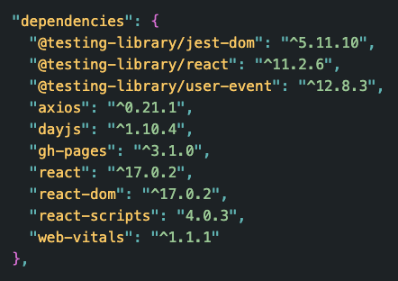

# Employee Directory 


## Table of Contents
- [Deployed Application](#deployed-application)
- [Description](#description)
- [Technologies](#technologies)
- [Install](#install)
- [Usage](#usage)
- [Build](#build)
- [Application Demo](#application-demo)
- [License](#license)
- [Contact](#contact)

## Deployed Application
Visit the deployed application here: [Employee Directory](https://jxhnkndl.github.io/employee-directory/)

## Description
This React powered user directory app offers employees and managers a quick way of accessing and filtering basic non-sensitive data about other team members. The application features a clean, intuitive user interface, a search bar for filtering employees by name or by phone number, and a results table that can be dynamically sorted by name in either ascending or descending order.


## Technologies

- HTML
- CSS
- Bootstrap
- JavaScript
- React

## Install

While the application can be visited and interacted with at [here](#deployed-application), it can also be installed and configured to run locally using the steps below.

This application requires Node.js and npm to run locally. To check whether Node.js and npm are installed locally, run:

```
node -v
```

```
npm -v
```

If Node and npm are already installed, the commands above should return version numbers. Visit [Node.js](http://www.nodejs.org/) and [npm](https://docs.npmjs.com/downloading-and-installing-node-js-and-npm) for full installation details and documentation.

Running this application locally requires installation of the following dependencies: 

  

**Note:** The `gh-pages` package is only used for deploying the live application and, as such, is not necessary to run the applicaiton locally.

To install the project and its npm dependencies, navigate to the project's root directory and run:

```
npm install
```

Once all third-party packages have been successfully installed, the application is ready to use.

For more details regarding production and development dependencies, reference the application's `package.json` file.


## Usage

Once npm packages have been installed and the database has been initialized, the application can be launched:

```
npm start
```

## Build

This application was built using the `create-react-app` package and gets built React's optimization pipeline (`webpack` + `babel`). Anytime the application is launched from a local development environment using the `npm start` script, React creates a new build to ensure maximum optimization.

To manually initiate a new build, run the application's `build` script:

```
npm run build
```


## Application Interface

The following gif showcases the application's user interface and demonstrates its core functionality:

  


## License

Copyright (c) 2021 J.K. Royston  
Licensed under the [MIT License](https://opensource.org/licenses/MIT).

## Contact

J.K. Royston  
<jkroyston@gmail.com>  
[GitHub](https://www.github.com/jxhnkndl)
